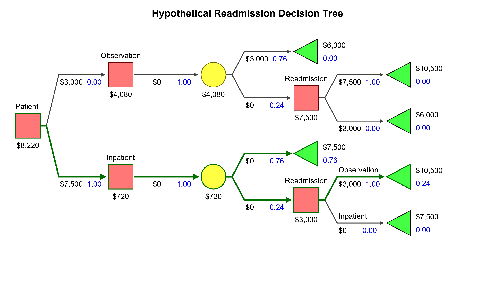
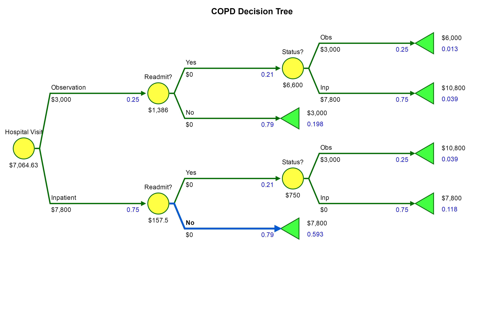

Data Foreward: 
Included is the code utilized for data collection and extraction, however, a comprehensive analysis is not peformed as we are proceeding more with hypothetical scenarios and our focus in this class is not data tidying. Please see the comments listed in the data acquistion

```{r}
library(RCurl)
library(plyr)
#url <- "https://raw.githubusercontent.com/mfarris9505/Medicare/master/data/IPPS_All_DRG.csv"
#dat <- getURL(url, ssl.verifypeer=0L, followlocation=1L)
#dat <- read.csv(text=dat)
setwd("C:/Users/MOM/Documents/GitHub/Medicare")
all_drg <- read.csv("data/IPPS_All_DRG.csv")
all_drg <-data.frame(all_drg)
ny_all_drg <- subset(all_drg, Provider.State == "NY")

#Poverty Info: 
# This is the data set extracted from the Poverty Rate Dataset
ny_pov_14 <- read.csv("data/NYPov2014.csv")
#Basic Clean up, keeping only County and Poverty Rate
col_keep <- c("fips2", "county2", "total_est_pct3")
ny_pov_14<- ny_pov_14[,col_keep]
colnames(ny_pov_14) <- c("FIPS","County","Pov.Rate")
reg_pov<- ny_pov_14
colnames(reg_pov) <- c("region","County","value")


#FIPS to ZIP crosswalk
#Used to turn ZIp code into County(For Poverty Rates)
zip_fips <- read.csv("data/ZIP_FIPS.csv")
colnames(zip_fips) <- c("Provider.Zip.Code","FIPS")

#Join Poverty Rates to Data file: 
ny_all_drg <- join(ny_all_drg, zip_fips, by="Provider.Zip.Code", type="left")
ny_all_drg <- join(ny_all_drg, ny_pov_14, by="FIPS", type="left")
ny_agg <- aggregate(Average.Medicare.Payments ~ Provider.Id , ny_all_drg, mean)

#Location Info
#ur <- "https://raw.githubusercontent.com/mfarris9505/Medicare/master/data/Hosp_Info.csv"
#dat <- getURL(url, ssl.verifypeer=0L, followlocation=1L)
#dat <- read.csv(text=dat)

hosp_info <- read.csv("data/Hosp_Info.csv")
hosp_info <-data.frame(hosp_info)
ny_hosp_info <- subset(hosp_info, State == "NY")

#Dataset was untidy necessary code to split location Lat and Long
ny_hosp_info$Lat <- lapply(strsplit(as.character(ny_hosp_info$Location), "\\("), "[", 2)
ny_hosp_info$Long <- lapply(strsplit(as.character(ny_hosp_info$Lat), "\\,"), "[", 2)
ny_hosp_info$Lat <- lapply(strsplit(as.character(ny_hosp_info$Lat), "\\,"), "[", 1)
ny_hosp_info$Long <- lapply(strsplit(as.character(ny_hosp_info$Long), "\\)"), "[", 1)
ny_hosp_info$Long <- as.numeric(ny_hosp_info$Long)
ny_hosp_info$Lat <- as.numeric(ny_hosp_info$Lat)
col_keep <- c("ï..Provider.ID", "Lat", "Long")
ny_hosp_info <- ny_hosp_info[,col_keep]
colnames(ny_hosp_info) <- c("Provider.Id","Lat","Long")
ny_hosp_info <- join(ny_hosp_info, ny_agg, by="Provider.Id", type="left")
ny_hosp_info <- na.omit(ny_hosp_info)
colnames(ny_hosp_info) <-c("Provider.ID", "Lat", "Long", "Payment")

#Readm/Mort Data
ny_readm_mort <- read.csv("data/NYData.csv")
ny_readm_mort$READM <- as.numeric(as.character(ny_readm_mort$READM))

#Subseting data by Heart Failure 
ny_hf <- subset(ny_readm_mort, Comb.DRG == "HF" )
hf_pay <- aggregate(Average.Medicare.Payments ~ Provider.Id , ny_hf, mean)
hf_mort <- aggregate(MORT ~ Provider.Id , ny_hf, mean)
hf_readm <- aggregate(READM ~ Provider.Id , ny_hf, mean)

#Combining data 
ny_hf <- join(hf_pay, hf_mort, by="Provider.Id", type="left")
ny_hf <- join(ny_hf, hf_readm, by="Provider.Id", type="left")
ny_hf <- na.omit(ny_hf)

#Subsetting by COPD
ny_copd <- subset(ny_readm_mort, Comb.DRG == "COPD" )
copd_pay <- aggregate(Average.Medicare.Payments ~ Provider.Id , ny_copd, mean)
copd_mort <- aggregate(MORT ~ Provider.Id , ny_copd, mean)
copd_readm <- aggregate(READM ~ Provider.Id , ny_copd, mean)
ny_copd <- join(copd_pay, copd_mort, by="Provider.Id", type="left")
ny_copd <- join(ny_copd, copd_readm, by="Provider.Id", type="left")
ny_copd <- na.omit(ny_copd)
```


##Introduction: 

Medicare Prospective Payment System, is a complex and diverse system of payments that have substantially influenced the inpatient hospital systems throughout the country. In brief, our medicare program is governed by a system of rules and regulations that hospitals must follow in order to be adequately paid. The origins of Medicare are long-standing, but as one of the only "Federally" mandated insurance program, Medicare is our one link to insight regarding our healthcare in this country. Most private insurance companies use Medicare guidelines as precedent for establishing their own contracts and payments. Unfortunately, due to the contractual nature of these private organizations, the public, as a whole is not privy to the reimbursement of these insurance companies. However, Medicare has released all of its available data encompassing payments for roughly 66% of hospitals. As Medicare, is our standard for payment, we will use these payments to understand and propose new standards for hospital care. Healthcare in this country is a complex, convoluted, and individualistic payment system that varies dramatically from hospital to hospital. Our main goal with this project is to ask the questions, How is this system working? What problems does it have? 

## Proposal 

In our proposal we divided up the project into 3 categories:

**Analysis of Poverty Rates vs. Payments**

Our first proposal was to do a detailed analysis of poverty rates vs. payments however, as visiualized in the below graphic: 
```{r}
Map
library(choroplethr)
library(ggplot2) 
choro_pov = county_choropleth(reg_pov, state_zoom="new york", num_colors=5) + 
  ggtitle("New York Counties\n Poverty Rate 2014") +
  geom_point(aes(Long, Lat, size = Payment, group = NULL), 
             data=ny_hosp_info, 
             alpha = I(0.3))+
  coord_map()

choro_pov
```


As you can see from the above graphic, the hospitals are not evenly sparsed across the counties, and in fact you can see that even outside New York City, the hospital tend to bunch along easily accessible routes and cities. This makes any comparision with poverty rates in the surround areas difficult, so for our purposes here we shifted away from socioeconomic indicators and moved towards medicare's own standards. 


**Payment vs. Indicators**
The second part of project, the focus turned to indicator data. Here the analysis turned to basic linear regression modelling. The goal here was to provide a break down of the data itself, to better understand our collected data, and in the end provide us with a comprehensive data set to analyse.

**Modelling**

The last part to our proposal was building of a model to better understand Medicare and Insurance payment systems. Throught the data analysis provided regarding Readmission vs. Payment data, our focus was narrowed to a specific area of focus for Medicare, that of readmissions, and we could then produce a intricate deciscion tree model that we could test with simulations.

## Data Collection:

For our data collection, our primary source of data came from Medicare.Data.Gov[Reference 3,4,5].  and furthermore, we have collected some poverty rates from the Department of Agriculture [3]. As the poverty rates were not the primary focus of this project, we will not include a detailed description of the data source used. 

However, the primary data sources we used was from CMS, or the Center For Medicare and Medicaid services. This is the governing agency for medicare, and upholds all of the federal regulations for medicare. Furthermore, CMS releases set payments for procedures, designates which procedures are inpatient, and provides diagnostic groups. The dataset used were: 

* Hospital General Information[5]
* Readmissions and Deaths - Hospital [5]
* IPPS Provider Summmary for all DRG - FY2014  [6]

The above data was cleaned and combined using R's join functions. Please see above code for more details.


## Data Analysis

For the first part of this project, it seemed apprarent that we analyze some of the data that Medicare had to offer, what we found to be interesting was that the data appears to show a tendency for hospitals with higher readmissions rates, getting paid more. The below graphs show this:
```{r}
fit<-lm(ny_hf$READM ~ ny_hf$Average.Medicare.Payments)

plot(ny_hf$Average.Medicare.Payments,ny_hf$READM, 
     main = "Readmission vs Payment for Heart Failure",
     xlab = "Payments", 
     ylab = "Readmission")
abline(fit)
```

```{r}
fit<-lm(ny_copd$READM ~ ny_copd$Average.Medicare.Payments)

plot(ny_copd$Average.Medicare.Payments,ny_copd$READM, 
     main = "Readmission vs Payment for COPD",
     xlab = "Payments", 
     ylab = "Readmission")
abline(fit)
```


## Modeling

### Readmissions and Medicare
Our primary goal here is to create a uniform model for Readmission Services. The Medicare Readmission Reduction Act of 2012, was Medicare's attempt to reduce cost.[7] The result of this act was that most insurance companies adopted a "No 30 Day Readmission for the same DRG" policy. This means, that irregardless of necessity of service, the insurance company would not pay for the 2nd admission, and that the hospital is responsible for combining the bill into one "combined admission." The idea behind this, is that the hospital did not provide the necessary care in the first admission to adequately "heal" the patient. Though, not necessarily a new idea, with the Federal Act in place, this finally gave insurance companies grounds to increase profitablity at the expensive of the Hosptial. It is this idea that we will attempt to model, and we are going to focus on 2 specific diagnosis that are by far the most common readmissions. These diagnosis are Heart Failure and COPD (Chronic obstructive pulmonary disorder). There has been many studies on these two disorders specifically, most of which point to the chronic nature of the disorders (ie. preventing readmissions is impossible), however, in a changing environment Hospitals must learn to adapt, and one possible avenue to prevent readmissions revolves around another Medicare push: OVservation.

### Observation 

Observation is a separate status from ED and Inpatient. For the most part, observation acts as an intermediate level of care, an "in between." Observation is meant for short-stay hospital visits, those that are just too long for a patient to remain in the ED, but too short to be fully admitted into the hospital. Though the care that is provided is expected to be the same as an inpatient stay, the payment is vastly different.[1]

Though the exact payment for observation level of care can very tremendously, and all depends on careful billing and documentation guidelines. With the new OPPS Prospective billing, medicare now created a starting packaged rate of $2,200[1] dollars. This does not reflect the entirety of payments (ie. ED services, which can be billed separately unlike in inpatient were these services packaged together). For simplicity sake, we are going to assume that observation pays roughly $3000, which is hypothetically correct (ED visits usually cost around $800-$1000) [1]

Why do you ask is observation important? Because now hospitals have a decision to make, whether or not to admit as an inpatient, and risk the readmission, or observe the patient in observation, and forgo any penalties. 
Below we created a generic decision tree, that highlights a hospitals choices:



As you can see the red boxes represents the hospitals decisions while the Yellow circles represent the probability that a patient will be readmit. At each step, we see the prospective payoff, and as you can see from the solved payoff data, the best choice for hospitals resulting in the highest payoff would be to first admit to inpatient, and for any patient that comes in before the 30 day time-frame, to put them under observation. 

However, this is not entirely feasible, especially given the nature of Medicare and insurance companies. Insurance companies now review case concurrently, and if a case doesn't meet criteria for admission, or is a readmission, they can deny a claim. This means that for those cases that are boardline, there will be a cost for hospitals other than just taking a hit for readmissions. So, what we wanted to see, is the potential for decrease in payment given various "chances" of observations. For instance, how much of a decrease in payment will we see if we admit 90% to inpatient vs 75% or 60%? Will our overall payments drop dramatically? So, we changed our decision tree to look like this: 




and this:


Now, we no longer consider the "decision" to admit as yes or no, but as a probablity. And this emulates more accurately real world scenarios. A doctor will likely see a patient, and "choose" to admit based on his clinical judgement. Not all patients will be admitted. But if we were to tell doctors to try and observe more patients at a lower status, will we be able to avoid the readmission pitfall?

To find out the above model was simulated over all the New York hospitals, with 100 "patients" as our test subjects. Using  each hospitals own readmission rate and Average Payment as a standard, a model was created and simulated. The below code is that mock up:

```{r}
library(ggplot2)
model_hosp <- function(dat_frame,obs,obs_prop,readm_prop){
  payments <- c()
  readmission <- c()
  
  for (i in 1:length(dat_frame[,"Average.Medicare.Payments"])){
    pay <- 0
    readm <- 0 
    payment <-0
    readm_num <-0
    for (j in 1:100){
      obs_1 <-sample(c(TRUE,FALSE),1, prob = c(obs_prop,1-obs_prop))
      readm_1 <-sample(c(TRUE,FALSE),1, prob = c(readm_prop,1-readm_prop))
      obs_2 <-sample(c(TRUE,FALSE),1, prob = c(obs_prop,1-obs_prop))
      readm_num <- 0
      if (obs_1 == TRUE){
        payment <-obs
        if((readm_1 == TRUE) & (obs_2 ==TRUE)){
          payment<- payment + obs
          readm_num <- 1
        }else if ((readm_1 == TRUE) & (obs_2 ==FALSE)) {
          payment <- obs +dat_frame[i,"Average.Medicare.Payments"]
          readm_num <- 1
        }
      }else if (obs_1 == FALSE){
        payment <-dat_frame[i,"Average.Medicare.Payments"]
        if((readm_1 == TRUE) & (obs_2 ==TRUE)){
          payment<- payment + obs
          readm_=num <- 1
        }else if((readm_1 == TRUE) & (obs_2 ==FALSE)){
          readm_num <- 1
        }
      }
      pay <- pay + payment
      readm <- readm + readm_num
    }
    pay<- pay/100
    readm<-readm/100
    payments <- append(payments, pay)
    readmission <- append(readmission,readm)
  }

  return(payments)
}
```


The above model was then run according to the precentage of observation vists, with increasing numbers, and then the average payment per hospital was generated over each trial. A box plot of the average payment is given as: 
```{r}
Prob_05 <- model_hosp(ny_copd,3000,.05,.25)
Prob_10 <- model_hosp(ny_copd,3000,.10,.25)
Prob_15 <- model_hosp(ny_copd,3000,.15,.25)
Prob_20 <- model_hosp(ny_copd,3000,.20,.25)
Prob_25 <- model_hosp(ny_copd,3000,.25,.25)
Prob_30 <- model_hosp(ny_copd,3000,.30,.25)
Prob_40 <- model_hosp(ny_copd,3000,.40,.25)

copd_prob <- data.frame(Prob_05,Prob_10,Prob_15,Prob_20,Prob_25,Prob_30,Prob_40)
p1 <- ggplot(stack(copd_prob), aes(x = ind, y = values)) +
  geom_boxplot()+
  ggtitle("COPD Payments vs. Observation Probability ")+
  xlab("Observation Precentages")+
  ylab("Payment")
p1
``` 
From the above graph we can see that indeed there is a decrease in payment the more that observation is implemented in regards to readmissions. However, the decrease is not as signicant as one may expect.

Again we plotted the same data with Heart Failure: 
```{r}
Prob_05 <- model_hosp(ny_hf,3000,.05,.25)
Prob_10 <- model_hosp(ny_hf,3000,.10,.25)
Prob_15 <- model_hosp(ny_hf,3000,.15,.25)
Prob_20 <- model_hosp(ny_hf,3000,.20,.25)
Prob_25 <- model_hosp(ny_hf,3000,.25,.25)
Prob_30 <- model_hosp(ny_hf,3000,.30,.25)
Prob_40 <- model_hosp(ny_hf,3000,.40,.25)

hf_prob <- data.frame(Prob_05,Prob_10,Prob_15,Prob_20,Prob_25,Prob_30,Prob_40)
p1 <- ggplot(stack(hf_prob), aes(x = ind, y = values)) +
  geom_boxplot()+
  ggtitle("HF Payments vs. Observation Probability ")+
  xlab("Observation Precentages")+
  ylab("Payment")
p1

```
And we again see that there is a cost to using observation more frequently, but when it comes to readmissions, the cost may out weigh the benefits. Taking this one step further, we found the average at each percentage and compared the two: 

```{r}
library(ggplot2)
library(reshape2)
hf_means<- colMeans(hf_prob)
copd_means<- colMeans(copd_prob)

prob<-c(5,10,15,20,25,30,40)

hf_means <- melt(hf_means)
copd_means <- melt(copd_means)

comb_means <- data.frame(prob,hf_means,copd_means)
colnames(comb_means) <- c("Prob", "HF","COPD")

ggplot(comb_means, aes(prob)) + 
  geom_point(aes(y = HF, colour = "HF")) + 
  geom_point(aes(y = COPD, colour = "COPD"))+
  ggtitle("Payment Vs Observation Prob")+
  ylab("Payment")
  
```

Results: 

From the modeling experiment, it has been determined that the current system, admitting to inpatient, is the most profitable for hospitals. However, with the changes in Medicare reimbursement, and with the onslaught of denials and taking back payments, Observation appears to be a viable strategy. As of now, there are no limitations to the number of observation stays that a hospital can bill, there is no regulation regarding reviews being done concurrently in the hospitals, these stays are being paid for in full, and the hospital doesn't have to worry about future audits. However, by taking the less payment upfront, it can be seen in the graph above, that indeed, the hospital is limiting their potential payment. They will not be able to recoup up enough upfront, but they are likely to avoid a lot of pitfalls. 


## References: 

[1]Wiler, J. L., Ross, M. A. and Ginde, A. A. (2011), "National Study of Emergency Department Observation Services." Academic Emergency Medicine, 18: 959-965. doi:10.1111/j.1553-2712.2011.01151.x http://onlinelibrary.wiley.com/doi/10.1111/j.1553-2712.2011.01151.x/full

[2]McKenzie D.A, CAE,"Observation Care Payments to Hospitals FAQ" American College of Emergency Physicians(ACEP) Updated:04/29/2016
https://www.acep.org/Clinical---Practice-Management/Observation-Care-Payments-to-Hospitals-FAQ/

[3]Parker, T. "County-level Data Sets" US Dept. of Agriculture: Economic Research Studies Updated: 02/03/2015
https://www.ers.usda.gov/data-products.aspx

[4] Renner, R."HUD USPS ZIP Code Crosswalk Files" Office of Policy Development and Research. 
https://www.huduser.gov/portal/datasets/usps_crosswalk.html#codebook

[5]"Hospital Compare Datasets". Centers for Medicare & Medicaid Services. Updated 10/19/2016
https://data.medicare.gov/data/hospital-compare

[6] "Inpatient Prospective Payment System (IPPS) Provider Summary for All Diagnosis-Related Groups (DRG) - FY2014" Centers for Medicare & Medicaid Services Updated Updated: 6/23/2016
https://data.cms.gov/Public-Use-Files/Inpatient-Prospective-Payment-System-IPPS-Provider/9zmi-76w9

[7] "Readmissions Reduction Program (HRRP)" Center For Medicare and Medicaid Services. Updated: 04/18/2016 
https://www.cms.gov/medicare/medicare-fee-for-service-payment/acuteinpatientpps/readmissions-reduction-program.html